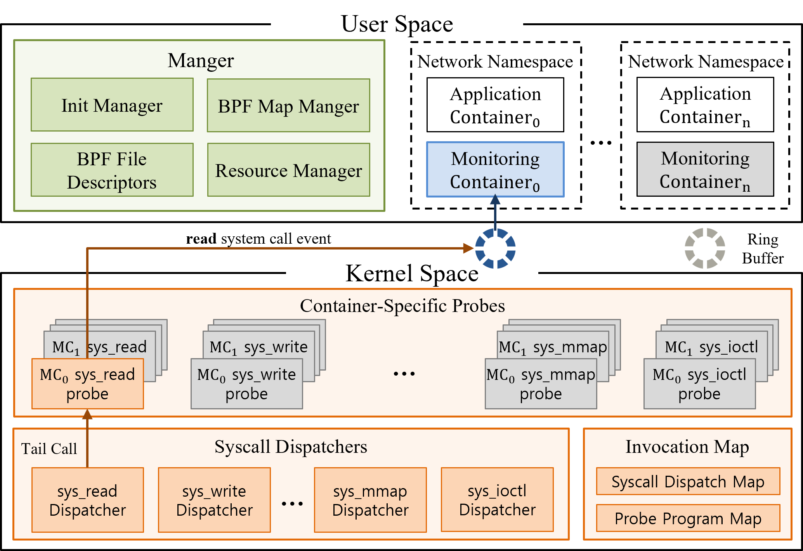

# SCALE: Differentiated Resource Allocation for Timely System Call Auditing in Containerized Environments

This repository provides **SCALE**, a differential distributed system call event collection framework for containerized workloads. SCALE adopts the sidecar pattern, where a monitoring container is deployed alongside the application container. This design enables real-time collection of system calls from application containers without granting excessive privileges to the monitoring component.

# Overview

    

In the user space, the components include the Init Manager, BPF Map Manager, BPF File Descriptor, Resource Manager, and Monitoring Container. The Init Manager and BPF Map Manager identify required environmental information and distribute configurations, ensuring that each Monitoring Container can collect system call events effectively. Each Monitoring Container runs as a sidecar alongside its corresponding application container within the same network namespace. It creates probes for each system call that process event data within the kernel and collects the resulting outputs.

In the kernel space, SCALE consists of Container-Specific Probes, Invocation Map, and Syscall Dispatchers. The Syscall Dispatchers hooks into the system call path and, upon each system call, identifies the application container that issued the call and triggers the corresponding probe of its Monitoring container. Once activated, the probe extracts and preprocesses system call metadata before placing it into a shared buffer accessible to the collector.

# How to use

**SCALE** can be executed as follows:

1. Run `make` inside the `/SCALE/Control` directory
2. Launch the SCALE Manager by executing `/SCALE/build/main_controller`
3. On the Kubernetes master node, deploy `/SCALE/pod.yaml` to create a Pod containing both the application and monitoring containers

# Setting

- The container images we built ourselves are excluded from this repository to preserve anonymity, but the corresponding Dockerfiles are included for reproducibility. Public images can be used as-is; where an image is commented out, build it from the Dockerfile in the corresponding directory before use.

- This project implements its eBPF programs in C, which requires the libbpf library to be installed on the host. In addition, since there is no publicly available container image that ships libbpf for every OS and version, the base image of some Dockerfiles has to be built manually. Install libbpf and build the base container image as follows:
  1. Identify your OS and version.
  2. On both the host and a container that matches the host environment, install BCC that matches your environment by following [BCC Github](https://github.com/iovisor/bcc/blob/master/INSTALL.md#source). (We recommend building and compiling BCC from source.)
  3. For the container, additionally perform the following steps:
     1. Commit the container as an image and use it as your base image.
     2. In each Dockerfile, replace the placeholder marked `"From libbpf image"` with the base image you built.
     3. Also update the Dockerfile so that it installs the `"linux-headers-{Kernel Version}"` package matching your kernel version.

- Our Docker images are not publicly released for anonymity during review; once the paper is accepted, we will also publish them.

# Evaluation

The evaluation results can be found in the paper (currently under review). The main evaluation is a performance comparison against existing system call collection tools, such as Tetragon and Tracee. The evaluation methodology is described below.

The `Evaluation` directory is organized as follows:

1. Benchmarks used in our experiments
   - This project uses the following benchmarks. Since our environment is containerized, each benchmark must be built as a container image. The Dockerfiles for these benchmarks are located in the `Experiments/Benchmark` folder.
   - Benchmarks
     - Custom Benchmark
     - Postmark Benchmark
2. Performance comparison with existing system call collection mechanisms (Throughput, Drop, Latency)
   - 2.1 Centralized Pattern
     - Baselines: Auditd, Perf, Sysdig, eBPF
   - 2.2 Distributed Pattern
     - Baselines: Perf, ftrace, eBPF

3. Performance comparison with existing systems (Throughput, Drop, Latency)
   - Installation and experiment instructions for these baselines can be found in `Experiments/Exp.Comparison_with_existing_systems/README*.md`.
   - Baselines: Tetragon, Tracee, eAudit, NoDrop
   - Baseline Installation:
     - [Tetragon](https://tetragon.io/docs/getting-started/install-k8s/). We recommend using v0.24.1 for reproducibility, with the Helm chart on k8s.chart on k8s
     - [Tracee](https://github.com/aquasecurity/tracee). We recommend using v0.24.1 for reproducibility, with the Helm chart on k8s.
     - [eAudit](https://github.com/seclab-stonybrook/eaudit). eAudit supports both Ubuntu 22.04 and 24.04, but we recommend Ubuntu 22.04 for reproducibility.
     - [Nodrop](https://github.com/PKU-ASAL/NoDrop). Due to NoDrop's characteristics, it must be run on Ubuntu 18.04 with Kernel 4.15.0.

4. Application-observed overhead
   - Baselines: Centralized/Distributed-eBPF,
