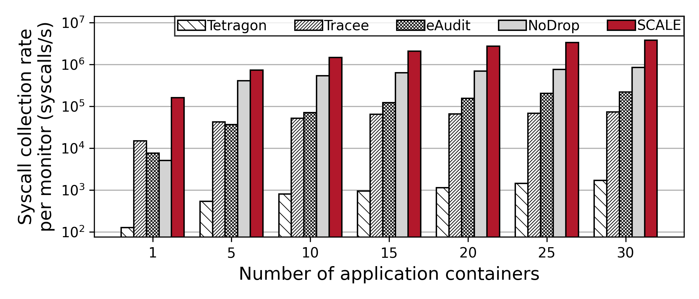
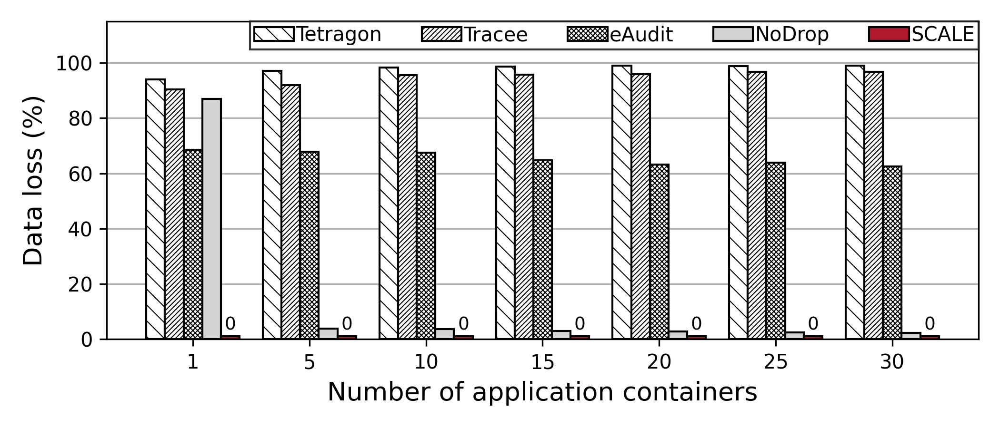
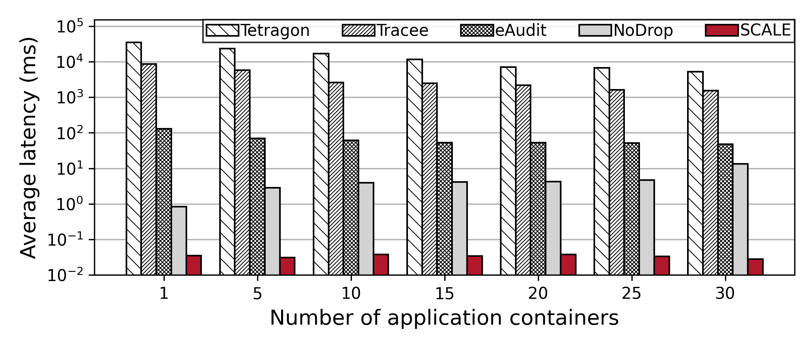
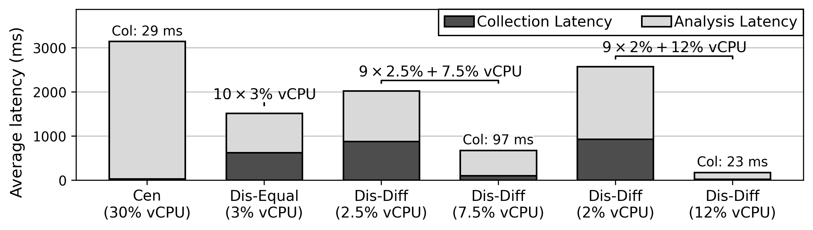
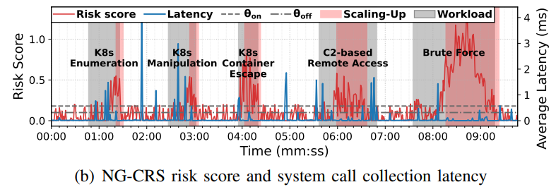

# SCALE-Risk-aware Distributed System Call Audit Framework for Cloud Native Environments

This repository provides **SCALE**, a risk-aware distributed system call event collection framework for cloud-native workloads running in Kubernetes. SCALE adopts the sidecar pattern, where a monitoring container is deployed alongside the application container. This design enables real-time collection of system calls from application containers without granting excessive privileges to the monitoring component.

# Overview

    

In the user space, the components include the Init Manager, BPF Map Manager, BPF File Descriptor, and Monitoring Container. The Init Manager and BPF Map Manager identify required environmental information and distribute configurations, ensuring that each Monitoring Container can collect system call events effectively. Each Monitoring Container runs as a sidecar alongside its corresponding application container within the same network namespace. It creates probes for each system call that process event data within the kernel and collects the resulting outputs.

In the kernel space, SCALE consists of Container-Specific Probes, Invocation Map, and Syscall Dispatchers. The Syscall Dispatchers hooks into the system call path and, upon each system call, identifies the application container that issued the call and triggers the corresponding probe of its Monitoring container. Once activated, the probe extracts and preprocesses system call metadata before placing it into a shared buffer accessible to the collector.

# How to use

**SCALE** can be executed as follows:

1. Run `make` inside the `/SCALE/Control` directory
2. Launch the SCALE Manager by executing `/SCALE/build/main_controller`
3. On the Kubernetes master node, deploy `/SCALE/pod.yaml` to create a Pod containing both the application and monitoring containers

# Evaluation

The detailed evaluation methodology and results can be found in the paper (currently under review). The main evaluation involves a performance comparison with existing system call collection tools, Tetragon and Tracee, and the experimental results are shown below.

## Comparison with Existing Systems

  
   
  <em>Host-wise collection rate.</em>

  
   
  <em>Data loss.</em>

  
   
  <em>Kernel-to-User space latency.</em>

To further assess the practicality of SCALE, we compare it with widely used open-source monitoring tools in cloud-native environments, namely Tracee and Tetragon, as well as representative academic audit architectures, including eAudit and NoDrop. The experiments employed postmark, where the number of containers running the benchmark was scaled and the CPU resources of the monitoring containers were increased proportionally. As in previous experiments, each monitoring container in SCALE was allocated 3\% of a vCPU and a 1~MB ring buffer. The results for throughput, data loss, and latency are presented in Figure~\ref{img:vs_system}.

## End-to-End Latency: Invocation to Analysis

  
   
  <em>End-to-end latency comparison across monitoring configurations: centralized (Cen), evenly distributed (Dis-Equal), and two differential distributed setups (Dis-Diff).</em>

To demonstrate the effectiveness of differential resource allocation, we evaluated end-to-end latency from system call invocation through event collection to analysis under centralized, evenly distributed, and differential distributed configurations. We used a custom benchmark in which ten application containers each generated approximately 10K system calls per second. Total vCPU allocated to monitoring containers was fixed at 30\% across all configurations to ensure a fair comparison.

## Evaluation using real attack scenarios

  
   
  <em>Risk score and system call collection latency accroding to NG-CRS using lateral movement attack scearnios on Online Boutique.</em>

To evaluate NG-CRS under realistic attack conditions, we conduct experiments using five MITRE ATT\&CK-based lateral movement scenarios spanning the full attack lifecycle: K8s Enumeration, K8s Manipulation, K8s Container Escape, C2-based Remote Access, and Brute Force, executed on the frontend microservice of the Online Boutique. For this evaluation, NG-CRS parameters are set to $\gamma_n = 0.01$, $\gamma_c = 0.04$, $b_{\text{on}} = 0.10$, $b_{\text{off}} = 0.30$, $m = 0.25$, $\varepsilon = 10^{-6}$, $\lambda = 3.0$, $\theta_{\text{on}} = 0.12$ and $\theta_{\text{off}} = 0.10$, $k_{\text{on}} = 4$, and $k_{\text{off}} = 3$. Figure shows the CPU and network usage of the frontend microservice alongside the NG-CRS risk scores and collection latency during each scenario. Table~\ref{tab:risk_scoring} summarizes the results across all four risk scoring methods.
